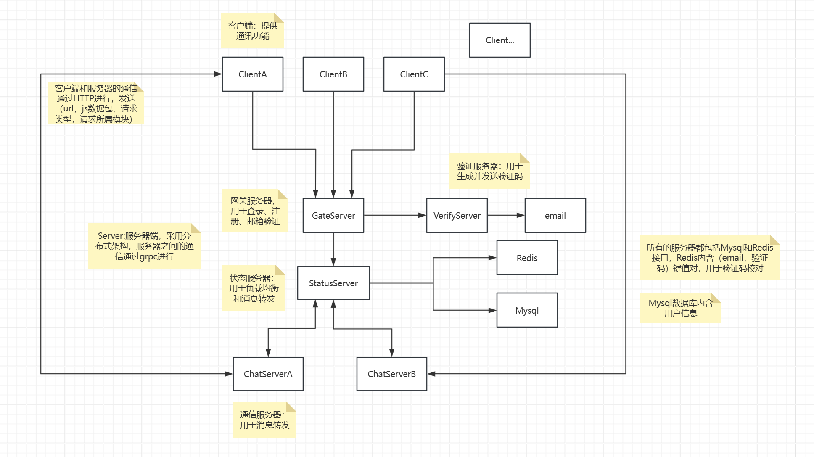
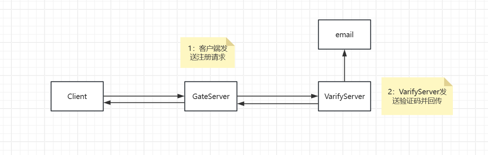
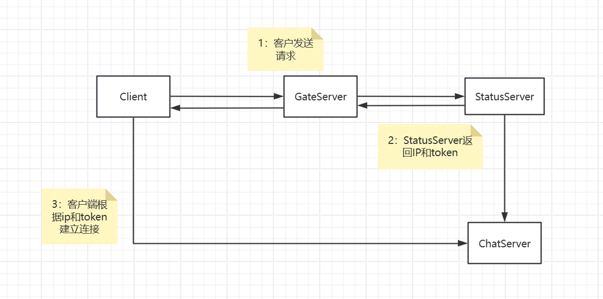
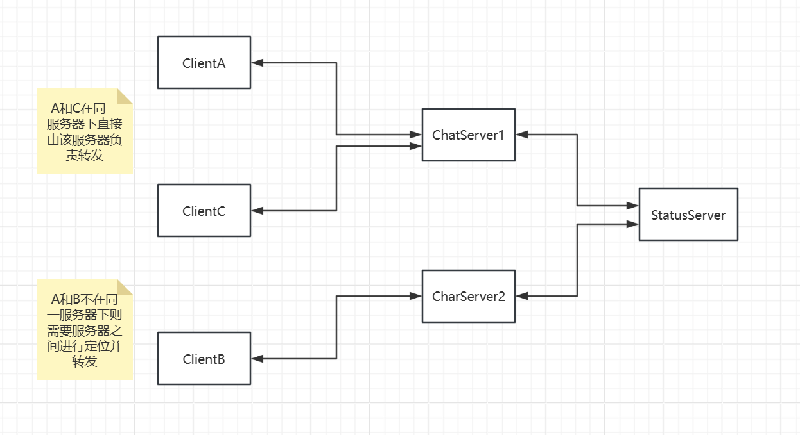

# QChatServer 目录结构
- **ChatServer/**
  - 主要负责聊天消息的处理与转发。
- **ChatServer2/**
  - 第二聊天服务器实例，承担聊天分流。
- **GateServer/**
  - 客户端连接入口，负责接收和分发初始请求。
- **StatusServer/**
  - 监控服务器运行状态，负责均衡聊天服务器负载。
- **VarifyServer/**
  - 验证服务器，处理用户注册、权限校验等功能。

通讯软件服务器端，c++实现
整体逻辑如下：

用户点击注册，客户端GateServer发送用户邮箱，GateServer将邮箱转发给VarifyServer，VarifyServer生成验证码并向用户邮箱转发，同时将验证码回传给GateServer，GateServer回传给客户端，用户输入验证码则进行核对，邮箱和验证码会储存在Redis中。

用户点击登录，客户端向GateServer发送请求，GateServer转发给StatusServer，StatusServer判断聊天服务器负载并生成用户对应的token，StatusServer将负载最小的聊天服务器ip地址和用户token回传给GateServer，且向对应聊天服务器发送一份token用于校验，客户端收到ip后向对应服务器发起TCP请求并提供token进行校验，聊天服务器校验正确后确认连接。

用户A向用户B发送消息，若两人在同一聊天服务器下，则服务器转发消息，否则转发给StatusServer查找用户B所在服务器进行转发。

项目涉及iocontex、mysqlconnection、Redisconnection、grpcconnectin等池保证并发性，采用分布式架构解决高并发下单个服务器瓶颈

